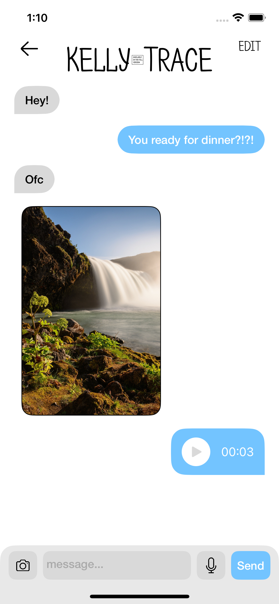

[![LinkedIn][linkedin-shield]][linkedin-url]

 

  

  <h3 align="center">KITE Chat</h3>
  <h4 align="center">(Coming to App store Soon!!)</h4>

  

    New Way of Mass Communication
     
    <a href="https://github.com/PanicGecko/Kite"><strong>Explore the docs »</strong></a>
     
  

  
Table of Contents

  <ol>
    <li>
      <a href="#about-the-project">About The Project</a>
    </li>
    <li>
      <a href="#demo">Demo</a>
    </li>
    <li><a href="#built-with">Built With</a></li>
    <li><a href="#architecture">Architecture</a></li>
    <li><a href="#contact">Contact</a></li>
  </ol>

## About The Project

Kite is a full-stack, production-ready chat platform engineered from day one to handle millions or even billions of concurrent users without breaking a sweat.
I built it as a showcase of modern, cloud-native architecture, solid software craftsmanship, and a passion for delightful real-time experiences.

I am only showing the UI part and the User Service Functionality. To learn more about the rest of the app plz contact me!! I'd be happy to explain

(<a href="#readme-top">back to top</a>)

## Demo

(<a href="#readme-top">back to top</a>)

## Built With
* [![Spring Boot][Spring-Boot]][SpringBoot-url]
* [![Redis][Redis-shield]][Redis-url]
* [![Swift][Swift-shield]][Swift-url]
* [![MySql][MySql-shield]][MySql-url]
* [![Cassandra][Cassandra-shield]][Cassandra-url]
* [![MongoDB][Mongo-shield]][Mongo-url]
* [![RabbitMQ][RabbitMQ-shield]][RabbitMQ-url]
* [![Nginx][Nginx-shield]][Nginx-url]
* [![Kubernetes][Kubernetes-shield]][Kubernetes-url]
* [![Dubbo][Dubbo-shield]][Dubbo-url]
* [![ZooKeeper][ZooKeeper-shield]][ZooKeeper-url]

(<a href="#readme-top">back to top</a>)

## Architecture

  

Kite was built with scalability and distributed-first in mind. Kite's backend is engineered around a "fan-out, stateless edge" philosophy: every component is purposed-built to maximize concurrency, minimize latency, and simplify operation. Here's how the pieces fit:
* ZooKeeper: Tracks live service instances, distributes configuration, orchestrates leader election
* Dubbo: Manages traffic to different services, Rpc protocal, Consumer/Service discovery
* Chat Server: Maintains long-lived WebSocket sessions only - no business logic - so each pod can handle hundreds of thousands of concurrent users (One Whatsapp server back in 2015 is able to hand about 1 million users, I'm confident mine will do the same)
* Chat Service: handles where to send messages and stores and deletes messages
* Microservices:
  * User Service: handles user authentication and creates chats
  * Image Service: handles sending images
  * Voice Service: handles sending voice messages
* Kubernetes: Schedules every microservice container, auto-scales pods on CPU/RAM or custom latency metrics, and rolls out blue/green or canary deploys
* Data:
  * MySql: stores user data
  * Cassandra: stores messages
  * MongoDB: used to help send images and voice messages
  * Redis: stores verification codes, online users
* Message Queue: Stores messages that needs to be sent to users

(<a href="#readme-top">back to top</a>)

## Contact
Adam Chao - [LinkedIn](www.linkedin.com/in/adam-chao)

Project Link: [https://github.com/PanicGecko/Kite](https://github.com/PanicGecko/Kite)

(<a href="#readme-top">back to top</a>)

[linkedin-shield]: https://img.shields.io/badge/-LinkedIn-black.svg?style=for-the-badge&logo=linkedin&colorB=555
[linkedin-url]: https://linkedin.com/in/adam-chao
[Spring-Boot]: https://img.shields.io/badge/Spring%20Boot-ffffff?style=for-the-badge&logo=springboot&logoColor=#6DB33F
[SpringBoot-url]: https://spring.io/projects/spring-boot
[Redis-shield]: https://img.shields.io/badge/Redis-DD0031?style=for-the-badge&logo=redis&logoColor=white
[Redis-url]: https://redis.io
[Swift-shield]: https://img.shields.io/badge/Swift-F05138?style=for-the-badge&logo=swift&logoColor=white
[Swift-url]: https://developer.apple.com/swift/
[MySql-shield]: https://img.shields.io/badge/MySql-4479A1?style=for-the-badge&logo=mysql&logoColor=white
[MySql-url]: https://developer.apple.com/swift/
[Cassandra-shield]: https://img.shields.io/badge/Casssandra-ffffff?style=for-the-badge&logo=apachecassandra&logoColor=#1287B1
[Cassandra-url]: https://cassandra.apache.org/_/index.html
[Mongo-shield]: https://img.shields.io/badge/MongoDB-47A248?style=for-the-badge&logo=apachecassandra&logoColor=white
[Mongo-url]: https://www.mongodb.com
[RabbitMQ-shield]: https://img.shields.io/badge/RabbitMQ-ff6600?style=for-the-badge&logo=rabbitmq&logoColor=white
[RabbitMQ-url]: https://www.rabbitmq.com
[Nginx-shield]: https://img.shields.io/badge/Nginx-009639?style=for-the-badge&logo=nginx&logoColor=white
[Nginx-url]: https://nginx.org
[Kubernetes-shield]: https://img.shields.io/badge/Kubernetes-326CE5?style=for-the-badge&logo=kubernetes&logoColor=white
[Kubernetes-url]: https://kubernetes.io
[Dubbo-shield]: https://img.shields.io/badge/Dubbo-D22128?style=for-the-badge&logo=apache&logoColor=white
[Dubbo-url]: https://dubbo.apache.org/en/index.html
[ZooKeeper-shield]: https://img.shields.io/badge/ZooKeeper-64BC4B?style=for-the-badge&logo=apache&logoColor=white
[ZooKeeper-url]: https://zookeeper.apache.org
